layout: true

<div class="my-footer"><span>https://enpiar.com/talks/czi-2020/</span></div>

---

# Ursa Labs

.cols[
.fifty[

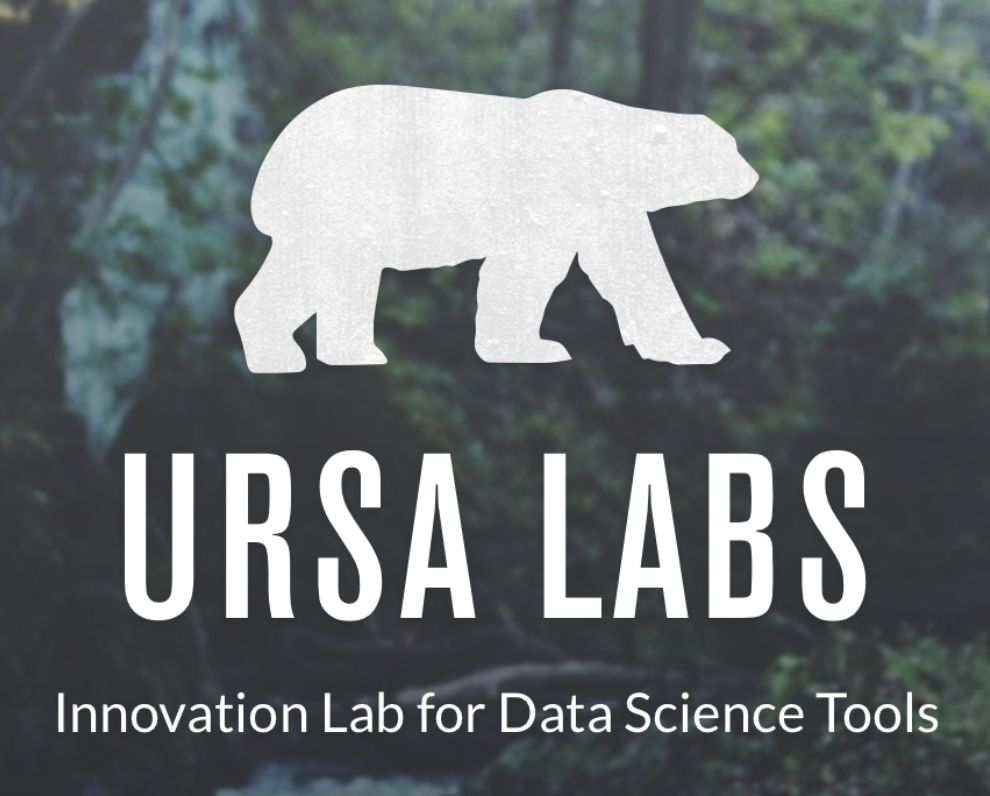

]

.fifty[

* Build cross-language, open libraries for data science

* Grow and maintain **Apache Arrow** ecosystem

* Funding and employment for full-time developers

* Consortium funded by multiple corporations

* https://ursalabs.org

]
]

---

class: inverse, center
background-image: url(../rstudio-conf-2021/img/this-is-not-yet-fine.png)
background-size: contain

# Created in 2016

---
class: middle

.cols[
.fifty[

# Format

]

.fifty[


]
]

---
class: middle

.cols[
.fifty[

# Libraries

]

.fifty[

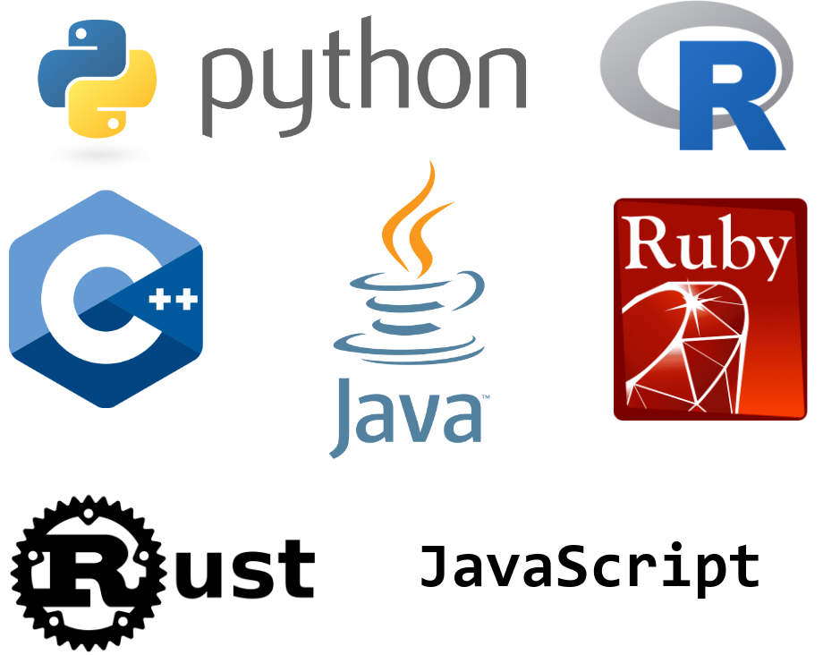
... and more


]
]

---
class: middle

.cols[
.fifty[

# Ecosystem

]

.fifty[

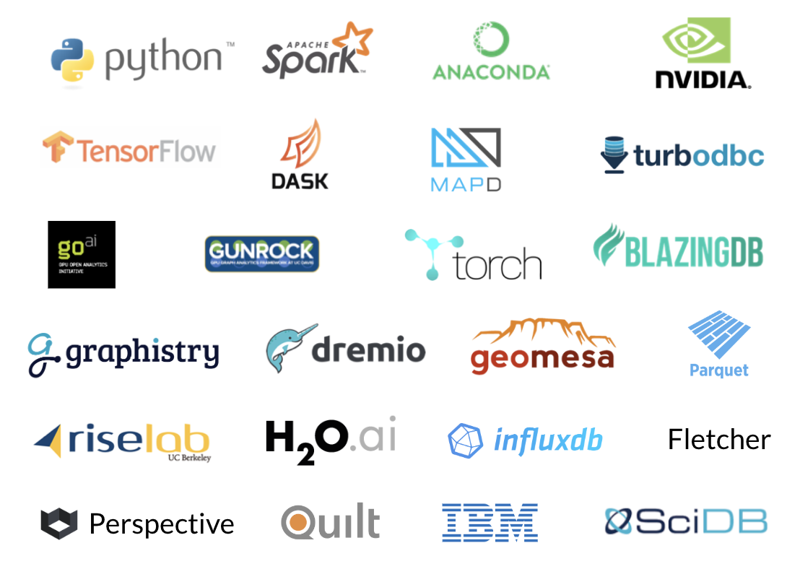


]
]

---
background-image: url(img/pyarrow-downloads.png)
background-size: contain

---

# Arrow library features

### Multi-file partitioned datasets (C++, Python, R)

https://enpiar.com/talks/rstudio-conf-2020/demo.html

125 files, ~2 billion rows

--

```r
ds <- open_dataset("nyc-taxi", partitioning = c("year", "month"))

system.time(ds %>%
  filter(total_amount > 100, year == 2015) %>%
  select(tip_amount, total_amount, passenger_count) %>%
  group_by(passenger_count) %>%
  collect() %>%
  summarize(
    tip_pct = median(100 * tip_amount / total_amount),
    n = n()
  ) %>%
  print())
```

---

# Arrow library features

### Multi-file partitioned datasets (C++, Python, R)

```r
## # A tibble: 10 x 3
##    passenger_count tip_pct      n
##              <int>   <dbl>  <int>
##  1               0    9.84    380
##  2               1   16.7  143087
##  3               2   16.6   34418
##  4               3   14.4    8922
##  5               4   11.4    4771
##  6               5   16.7    5806
##  7               6   16.7    3338
##  8               7   16.7      11
##  9               8   16.7      32
## 10               9   16.7      42

##    user  system elapsed
##   3.425   4.024   1.370
```

---

# Arrow library features

### Multi-file partitioned datasets (C++, Python, R)

```r
## # A tibble: 10 x 3
##    passenger_count tip_pct      n
##              <int>   <dbl>  <int>
##  1               0    9.84    380
##  2               1   16.7  143087
##  3               2   16.6   34418
##  4               3   14.4    8922
##  5               4   11.4    4771
##  6               5   16.7    5806
##  7               6   16.7    3338
##  8               7   16.7      11
##  9               8   16.7      32
## 10               9   16.7      42

*##    user  system elapsed
*##   3.425   4.024   1.370   <----------- 3x faster than last year
```

---

# Arrow library features

### Fast file reading/writing

C++ (Python, R, Ruby) has fast readers for CSV, JSON, Parquet, Feather

CSV benchmarking in R: https://enpiar.com/talks/nyr-2020/

---
background-image: url(../nyr-2020/img/taxi-single-1.png)
background-size: contain

---
background-image: url(../nyr-2020/img/taxi-single-arrow-1.png)
background-size: contain

---
background-image: url(../nyr-2020/img/taxi-single-df-1.png)
background-size: contain

---

# Arrow library features

.center[

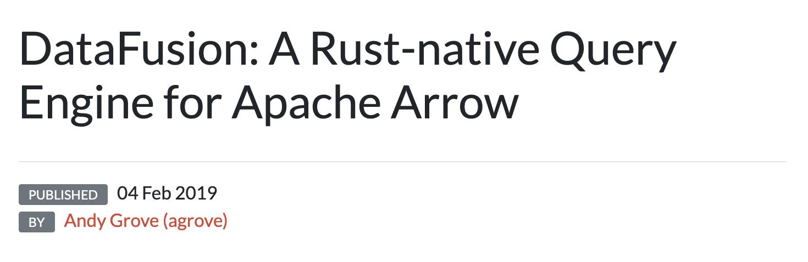

https://arrow.apache.org/blog/2019/02/04/datafusion-donation/

]

---

# Arrow library features

.center[

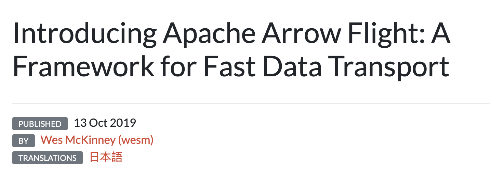

https://arrow.apache.org/blog/2019/10/13/introducing-arrow-flight/

]

---

# Selected projects based on Arrow

.center[


https://rapids.ai/

]

---

# Selected projects based on Arrow

.center[

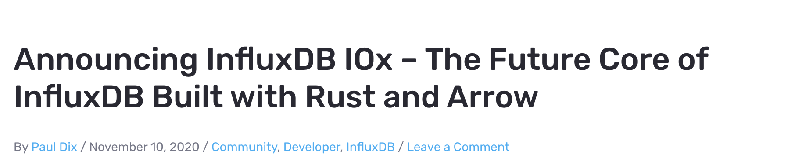

https://www.influxdata.com/blog/announcing-influxdb-iox/

]

---

# Selected projects based on Arrow

.center[
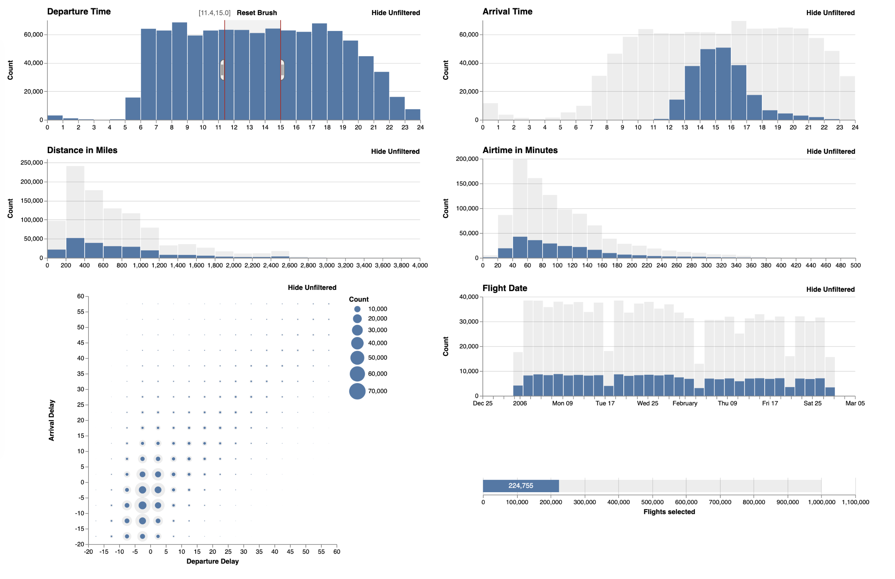

https://uwdata.github.io/falcon/flights/

]

---
background-image: url(img/basf.jpg)
background-size: contain

---

# Better living through Arrow


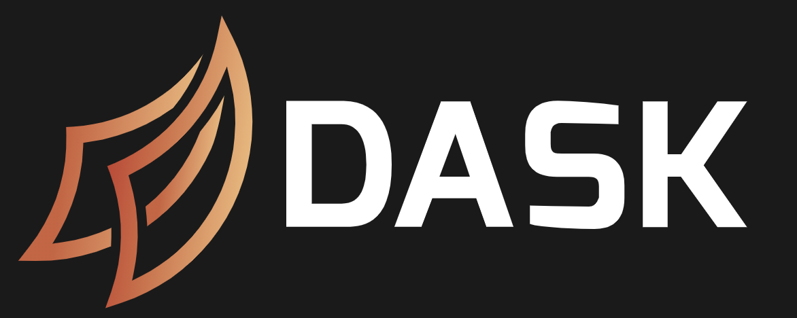

---
class: center

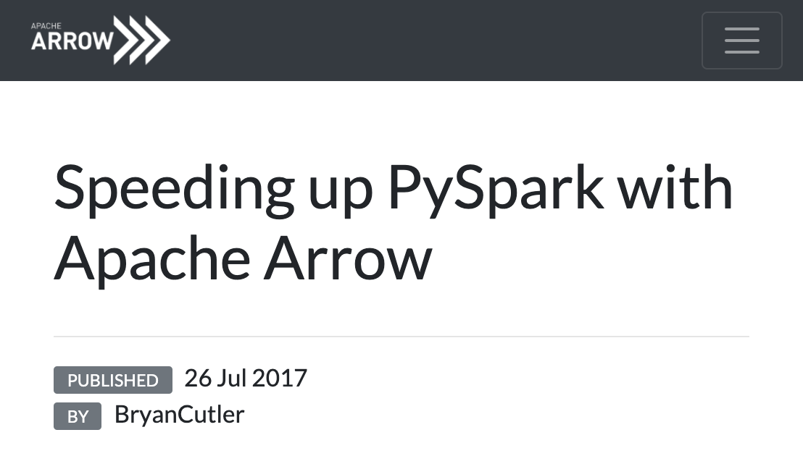

https://arrow.apache.org/blog/2017/07/26/spark-arrow/

---
class:center

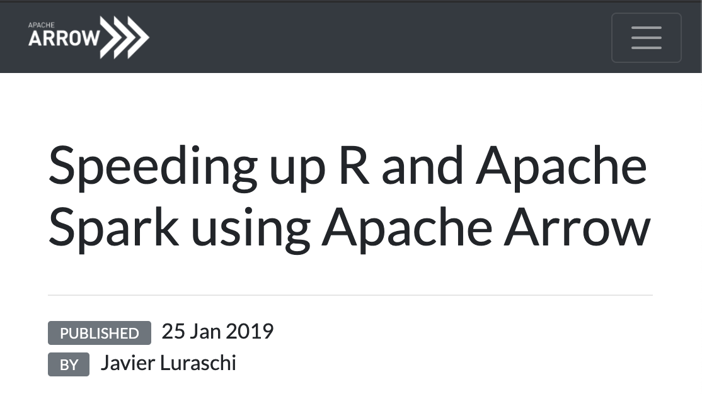

https://arrow.apache.org/blog/2019/01/25/r-spark-improvements/

---
class: center

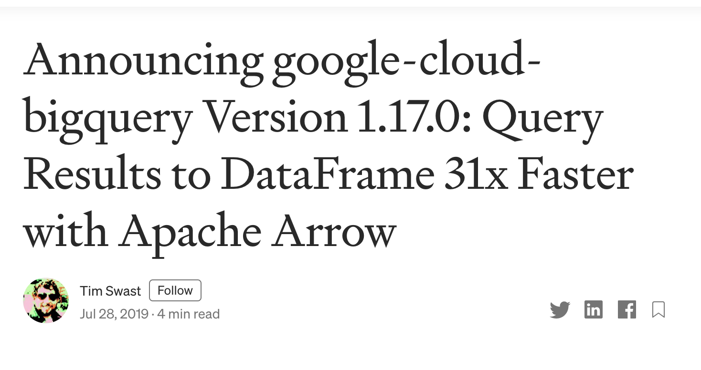

https://medium.com/google-cloud/announcing-google-cloud-bigquery-version-1-17-0-1fc428512171

---

# Key is language- <br/> agnostic format

---

background-image: url(../rstudio-conf-2021/img/arrow-format-1.png)
background-size: contain

# Key is language- <br/> agnostic format

---
background-image: url(../rstudio-conf-2021/img/arrow-format-2.png)
background-size: contain

---
background-image: url(../rstudio-conf-2021/img/arrow-format-3.png)
background-size: contain

---
background-image: url(../rstudio-conf-2021/img/arrow-format-4.png)
background-size: contain

---
background-image: url(../rstudio-conf-2021/img/arrow-format-5.png)
background-size: contain

---
background-image: url(../rstudio-conf-2021/img/arrow-format-6.png)
background-size: contain

---
background-image: url(../rstudio-conf-2021/img/arrow-format-7.png)
background-size: contain

---

# Arrow project growth and maturity

* Created 2016

* July 2020: 1.0 release, indicating format stability

* Up to 12 language implementations/bindings (Julia most recently added)

---
background-image: url(../rstudio-conf-2021/img/contributors.png)
background-size: contain

---

# Looking ahead

* Ursa Labs has played the role of "institutional maintainer" (an organized group, not a single person): how do we scale that as the project grows?

* What else can we do to support the developer community?

* How has the community evolved over the past 5 years?

* How will (and should) it evolve now that we've hit 1.0?

---

# Goal: grow + diversify maintainer base

Challenges:

* High technical barriers to entry

* Big project norms, Apache governance

* Leads to skewed + bimodal distribution: dozens of full-time contributors/maintainers, lots of one-off bugfixes from the community, very few part-time, casual contributors

--

*Welcoming and supporting new contributors is great but unlikely to create maintainers*

---

# CZI grant

* Establishes 2 one-year fellowship/apprenticeship positions

* Recruit engineers from traditionally underrepresented groups

* Pay to work full time on open source project, provide mentorship on open-source project maintenance, support to learn new technical skills

<!--

but we reasoned that we could have a broader impact if we (1) recruited less experienced developers from trad underrepresented and (2) could invite a new group every year rather than pay one person in perpetuity

-->

---
class: center, middle

# https://arrow.apache.org/

### @ApacheArrow
### @enpiar
