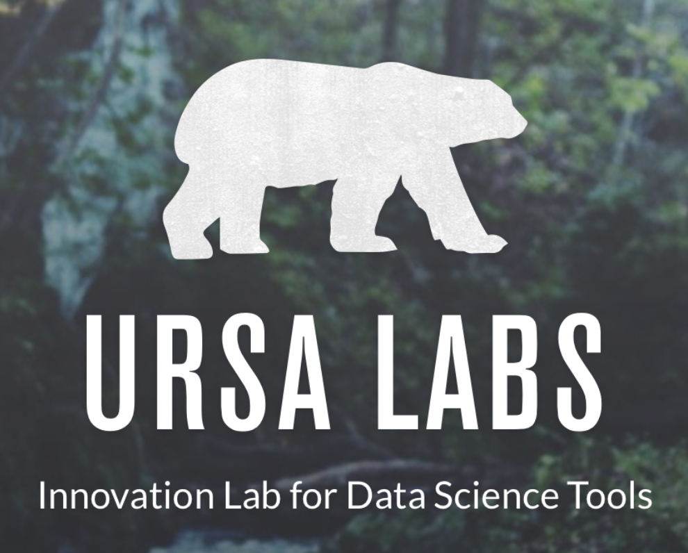
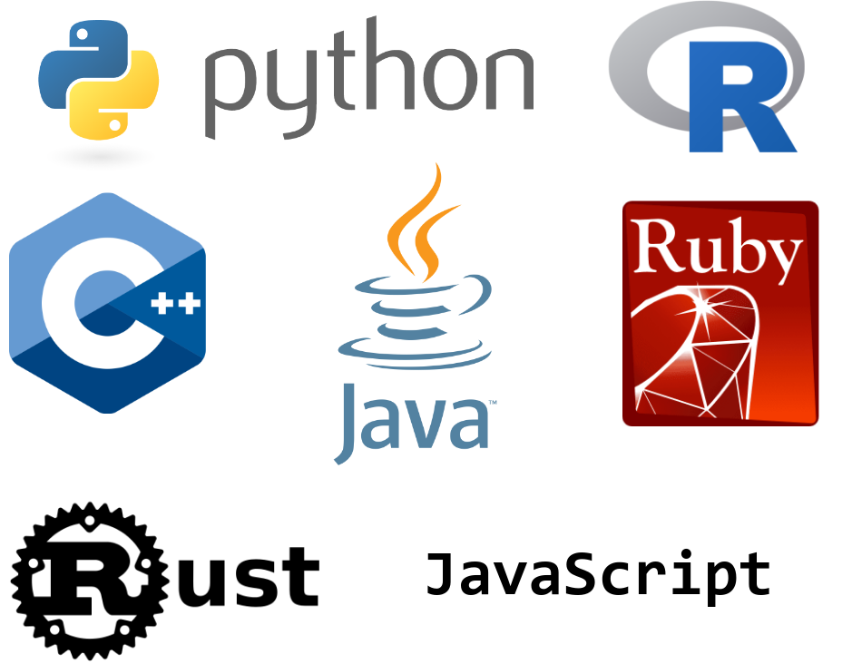
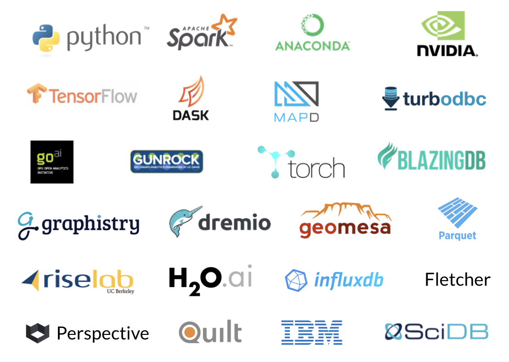

layout: true

<div class="my-footer"><span>https://enpiar.com/talks/rstudio-conf-2020/</span></div>

---

# Ursa Labs

.cols[
.fifty[



]

.fifty[

* Build cross-language, open libraries for data science

* Grow **Apache Arrow** ecosystem

* Funding and employment for full-time developers

* **Not-for-profit**, funded by multiple corporations

]
]

Come talk to us at the RStudio Community booth today 3:45pm

https://ursalabs.org

???

* Going to talk about Arrow: what it is, why you should use it, and how you can get involved in the community.
* But first, very briefly who I am so you know where I'm coming from:
* I'm engineering director at Ursa Labs, not-for-profit dedicated to developing open source data science tools. Main contributors to and maintainers of the Apache Arrow project.

---

class: center, middle
background-image: url(img/arrow-clipart-blue.png)

--

# What is Arrow?

???

* Whenever I tell people I work on Arrow, the response is usually "oh cool, I've heard of that. Wait, what exactly is Arrow?"
* Arrow is actually a few different things. The way I like to summarize the project and its goals is:

---

class: center, middle
background-image: url(img/arrow-clipart-blue.png)

### A foundation for the <br/> next-generation of data frames

---

# Yeah R is cool but have you ever

--

⬆️ had a dataset bigger than memory?

--

↩️ had data split across lots of files?

--

🔀 had complex data types (map columns, struct/data-frame columns, etc.)?

--

🔝 wanted to use more than 1 CPU (or GPUs)?

???

* I love R: so expressive, so powerful. But some limitations, which get more critical as our data gets bigger and more complex.

---

# These are not just limitations of R

https://wesmckinney.com/blog/apache-arrow-pandas-internals/


???

* Of course, these aren't just R problems. Wes McKinney, creater of Pandas, talked about this problem several years ago about the Python data ecosystem. Same issues: memory-bound, handling data types, missing data, parallel processing, etc.

* He and other ___ got together, realized they were all trying to solve the same problems in their respective languages/databases/domains, and decided to join forces

---

# Apache Arrow

🎉 Announced 2016

🦚 Feather package: interoperable data frame storage for R and Python, prototype of Arrow format

💡 Built on lessons of existing data frame libraries and databases

🏗️ Shared foundation for data analysis

🤖 Designed to take advantage of modern hardware

🔗 https://arrow.apache.org/

---

# Apache Arrow

.cols[
.fifty[

**Format** for how data is arranged in memory: columnar, language-independent


]

.fifty[


]
]

---

# Apache Arrow

.cols[
.fifty[

**Format** for how data is arranged in memory: columnar, language-independent


]

.fifty[
**Implementations** or bindings in 11 languages


... and more


]
]


---

# The arrow R package

📩 Wraps the C++ library and lets you work with these data structures efficiently in R with a familiar interface

➡️ On CRAN since August 2019: `install.packages("arrow")`

📅 0.16 release about to reach CRAN

🔗 https://arrow.apache.org/docs/r

--

🌉 Nightly binaries available:

```r
install.packages("arrow",
  repos = "https://dl.bintray.com/ursalabs/arrow-r")
```

🌃 Nightly docs: https://ursalabs.org/arrow-r-nightly/

---
class: center, middle, inverse

# [Example](demo.html)

---

# Arrow datasets

[`vignette("dataset", package = "arrow")`](https://ursalabs.org/arrow-r-nightly/articles/dataset.html)

➡️ Treat many files as a single entity

➡️ Use file paths to provide partition information

➡️ Select/filter is pushed to individual files, done in parallel

--

🔜 Future development: more file formats, more storage layers (S3, HDFS, GCP, Azure), aggregation in C++

???

New feature in the 0.16 release


---

# Reading/writing Parquet files

🗄️ Popular open standard binary file format for columnar data

💾 Used for I/O on nearly all modern data warehousing platforms

🗜️ Creates small files benefiting from compression and other encodings

---

# Reading/writing Parquet files

Benchmarking: see https://ursalabs.org/blog/2019-10-columnar-perf/

| Benchmark Case              | File size | Average read time |
|-----------------------------|-----------|-------------------|
| arrow::read_parquet         | **113 MB**    | 4.09s             |
| arrow::read_feather         | 3.96 GB   | 3.09s             |
| fst::read_fst               | 503 MB    | 3.75s             |
| data.table::fread           | 1.52 GB   | 5.09s             |
| feather::read_feather (old) | 3.96 GB   | 5.21s             |


---


class: center, middle
background-image: url(img/arrow-clipart-blue.png)

--

# Why Arrow?
Why not just use packages <br/> X, Y, ..., ZZ instead?

???

Of course, Arrow isn't the only project that tries to solve these problems.
Packages like XXX to handle bigger data and memory map
Packages to do parallel processing
And you could put your data in a database and query it with a dplyr-family package

If you like your tech stack, you can keep your tech stack

That said, there are several qualities of the Arrow project that distinguish it and make it worth considering

---

# Arrow is a big, active project 📈


---

# Arrow is a big, active project 📈

<iframe title="Unique Contributors to Apache Arrow" aria-label="Interactive line chart" id="datawrapper-chart-skGBa" src="//datawrapper.dwcdn.net/skGBa/1/" scrolling="no" frameborder="0" style="width: 0; min-width: 100% !important; border: none;" height="400"></iframe><script type="text/javascript">!function(){"use strict";window.addEventListener("message",function(a){if(void 0!==a.data["datawrapper-height"])for(var e in a.data["datawrapper-height"]){var t=document.getElementById("datawrapper-chart-"+e)||document.querySelector("iframe[src*='"+e+"']");t&&(t.style.height=a.data["datawrapper-height"][e]+"px")}})}();</script>

<!--  -->

---

# Lots of facets

🛫 **Flight**: client-server framework for fast transport of data https://arrow.apache.org/blog/2019/10/13/introducing-arrow-flight/

🦠 **Plasma**: shared-memory object store https://arrow.apache.org/blog/2017/08/08/plasma-in-memory-object-store/

🏹 **Gandiva**: LLVM expression compiler http://arrow.apache.org/blog/2018/12/05/gandiva-donation/

and more

---
background-image: url(img/community.png)

# Lots of projects are using Arrow

<!--  -->

<!-- Source https://docs.google.com/presentation/d/1qmvPpFU7sdm9l6A6LEyI0zIzswGtJW0Sbd_lfHLaXQs/edit#slide=id.g3bb61cd627_2_41  -->
<!-- TODO: update with more logos (Athena? other big projects) -->

???

* Lots of projects using Arrow as an efficient format to work with data and to transfer it
* TODO specific projects to name-check (Tensorflow exchange? Athena federated query?)

---
background-image: url(img/in-n-out.jpg)

# Interoperability

<!--  -->


???

↔️ Interchange format: e.g. get data from Spark more efficiently. rather than write out to CSV, which is row based, and have to read from disk, parse strings, infer types, transpose to columns.

---

# Example: Spark and R

https://arrow.apache.org/blog/2019/01/25/r-spark-improvements/


Up to 40x speedup when pulling data from Spark to R

All you have to do is `library(arrow)`

--

*Want more? Stay here for Javier's talk following this one*

---

# Arrow is language independent

🤝 Improve collaboration with non-R users

🗣 Lets us access in R projects from other languages

---

# Arrow is language independent

🔜 Coming soon: reticulate support 🐍

Something like:

```r
library(arrow)
library(reticulate)

cudf <- import("cudf")
df <- cudf$read_csv("huge_file.csv")
results <- df$groupby(c("year", "month"))$tip_amount$mean()
ggplot(results, ...)
```

🔗 https://rapids.ai/

---
class: center, middle
background-image: url(img/arrow-clipart-blue.png)

# Getting involved

???

Arrow is still a pretty young project. And while there's a lot of useful things you can do with it now---read Parquet files, read multi-file datasets, speed up Spark---there's a lot more we're working to build.

Arrow is an open-source, community driven project, and we depend on contributions from users like you to make it happen.

---

# 1. Try arrow

⬇️ `install.packages("arrow")`

⬇️ `conda install -c conda-forge r-arrow`

--

🌉 Nightly binaries available:

```r
install.packages("arrow",
  repos = "https://dl.bintray.com/ursalabs/arrow-r")
```

🌃 Nightly docs: https://ursalabs.org/arrow-r-nightly/

--

As of 0.16 It Just Works on Linux with *no system dependencies*

See [`vignette("install", package = "arrow")`](https://ursalabs.org/arrow-r-nightly/articles/install.html)

---

# 1. Try arrow

.cols[
.fifty[


]

.fifty[

```r


remotes::install_github("apache/arrow/r")


```

```r


options(repos = c(
  "https://dl.bintray.com/ursalabs/arrow-r",
  getOption("repos")
))
install.packages("arrow")


```
]
]


???

* First, you can try to use it. `arrow` is on CRAN, and as of the 0.16 release, installation on Linux platforms should just work without requiring any system dependencies. Binaries for macOS and Windows are also available and work out of the box.

* The Apache Arrow project makes official releases every few months, but we're continually adding new features and improvements. Ursa Labs hosts nightly builds at a CRAN-like repository, which you can point `install.packages` at.

---

# 2. Let us know what you think

➡️ Arrow is under active development

🤯 Show us your dirty data and hairy use cases

🔗 https://issues.apache.org/jira/projects/ARROW/issues

???

Of course, we'd love to hear how Arrow works for you, good and bad.

---

# 3. Pitch in

👋 We love new contributors!

✍️ Improve docs etc.


---

# 4. Sponsor Ursa Labs


* Support our dedicated engineering team (C++/Python/R)

* Spearhead big projects: datasets API, query engine

* Sustain the open-source community: bug triage, code review, CI, coordination, etc.

Contact us: [info@ursalabs.org](mailto:info@ursalabs.org)

New: GitHub Sponsors! https://github.com/sponsors/ursa-labs/


???

* Industry consortium, several sponsors, RStudio first among them
* Money goes to supporting our team of 7
* We contribute a majority of the C++/Python/R code in the project,
* and because we are able to focus full-time on the project, we can spearhead big projects like the datasets API and the fast query engine we plan to work on this year
* We also work to sustain the open source community to make it easier for others to participate: make sure bug reports get triaged, pull requests get reviewed and merged, continuous integration, etc.


---

class: center, middle
background-image: url(img/arrow-clipart-blue.png)

## Thank you!

RStudio Community booth<br/>Today @ 3:45pm

@ApacheArrow<br/>@enpiar
