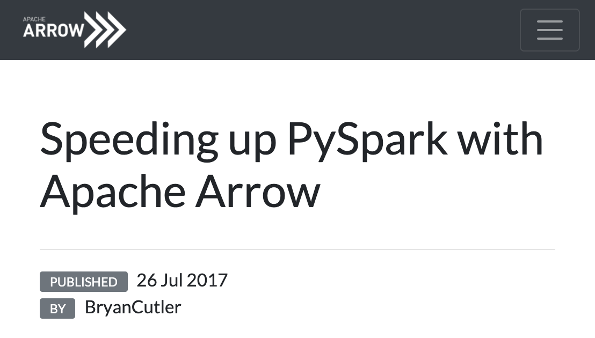
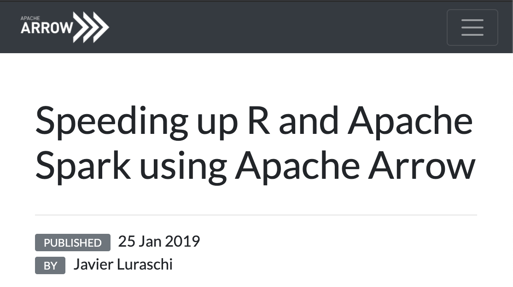

---
class: inverse
background-image: url(img/screen1v2.png)
background-size: contain
<!--  -->

---
class: inverse
background-image: url(img/screen2v4.png)
background-size: contain

<!--  -->

---
class: inverse
background-image: url(img/screen3v3.png)
background-size: contain

<!--  -->

---
class: inverse
background-image: url(img/screen4v3.png)
background-size: contain

<!--  -->

---
class: inverse
background-image: url(img/screen5v3.png)
background-size: contain

<!--  -->

---
class: inverse
background-image: url(img/screen6v2.png)
background-size: contain

<!--  -->

---
class: inverse
background-image: url(img/screen7v3.png)
background-size: contain

<!--  -->

---

---
background-image: url(img/this-is-not-yet-fine.png)
background-size: contain

---
class: middle

.cols[
.fifty[

# Format

]

.fifty[


]
]

---
class: middle

.cols[
.fifty[

# Libraries

]

.fifty[


... and more


]
]

---
class: middle

.cols[
.fifty[

# Ecosystem

]

.fifty[


]
]

---

---

background-image: url(img/win95.png)
background-size: contain

<!-- https://unsplash.com/photos/yY9n0N4P_oY -->

---
class: less-padding, center, middle

```{r, echo=FALSE, fig.retina = 2, fig.height = 8, fig.width=15}
waffle::waffle(c(1, 7, 88), rows = 8, colors = c("gray", "gray", "white"), legend_pos = "none")
```

---
class: less-padding, center, middle

```{r, echo=FALSE, fig.retina = 2, fig.height = 8, fig.width=15}
waffle::waffle(c(1, 7, 88), rows = 8, colors = c("gray", "gray", "gray"), legend_pos = "none")
```

---
class: less-padding, center, middle

```{r, echo=FALSE, fig.retina = 2, fig.height = 8, fig.width=15}
waffle::waffle(c(1, 7, 88), rows = 8, colors = c("blue", "gray", "gray"), legend_pos = "none")
```

---
class: center, middle, bigtext

# SIMD

### Single instruction, multiple data

---

background-image: url(img/fast-car.jpg)
background-size: contain

<!-- https://unsplash.com/photos/yY9n0N4P_oY -->

---

background-image: url(img/old-driver.jpg)
background-size: contain

<!-- https://unsplash.com/photos/tPxnF8LVNEI -->

---

---

background-image: url(img/contributors.png)
background-size: contain

---

---

# rstudio::conf(2020)

Demo of reading a multi-file Parquet dataset

https://enpiar.com/talks/rstudio-conf-2020/demo.html

125 files, ~2 billion rows

--

```r
ds <- open_dataset("nyc-taxi", partitioning = c("year", "month"))

system.time(ds %>%
  filter(total_amount > 100, year == 2015) %>%
  select(tip_amount, total_amount, passenger_count) %>%
  group_by(passenger_count) %>%
  collect() %>%
  summarize(
    tip_pct = median(100 * tip_amount / total_amount),
    n = n()
  ) %>%
  print())
```

---
# rstudio::conf(2020)

```r
## # A tibble: 10 x 3
##    passenger_count tip_pct      n
##              <int>   <dbl>  <int>
##  1               0    9.84    380
##  2               1   16.7  143087
##  3               2   16.6   34418
##  4               3   14.4    8922
##  5               4   11.4    4771
##  6               5   16.7    5806
##  7               6   16.7    3338
##  8               7   16.7      11
##  9               8   16.7      32
## 10               9   16.7      42

##    user  system elapsed
##  26.735   1.159   4.076
```

---

# NY R conference, August 2020

```r
## # A tibble: 10 x 3
##    passenger_count tip_pct      n
##              <int>   <dbl>  <int>
##  1               0    9.84    380
##  2               1   16.7  143087
##  3               2   16.6   34418
##  4               3   14.4    8922
##  5               4   11.4    4771
##  6               5   16.7    5806
##  7               6   16.7    3338
##  8               7   16.7      11
##  9               8   16.7      32
## 10               9   16.7      42

*##    user  system elapsed
*##   3.829   3.108   1.842   <----------- 2x faster
```

---

# rstudio::global(2021)

```r
## # A tibble: 10 x 3
##    passenger_count tip_pct      n
##              <int>   <dbl>  <int>
##  1               0    9.84    380
##  2               1   16.7  143087
##  3               2   16.6   34418
##  4               3   14.4    8922
##  5               4   11.4    4771
##  6               5   16.7    5806
##  7               6   16.7    3338
##  8               7   16.7      11
##  9               8   16.7      32
## 10               9   16.7      42

*##    user  system elapsed
*##   3.425   4.024   1.370   <----------- Another 25% faster
```
---

---
class: center, middle


---

---

background-image: url(img/arrow-format-1.png)
background-size: contain

---
background-image: url(img/arrow-format-2.png)
background-size: contain

---
background-image: url(img/arrow-format-3.png)
background-size: contain

---
background-image: url(img/arrow-format-4.png)
background-size: contain

---
background-image: url(img/arrow-format-5.png)
background-size: contain

---
background-image: url(img/arrow-format-6.png)
background-size: contain

---
background-image: url(img/arrow-format-7.png)
background-size: contain

---
class: center, middle



---
class: center, middle



---

---
class: bigtext

```r
ds <- open_dataset("nyc-taxi/csv/2019", format = "csv",
  partitioning = "month")
ds

## FileSystemDataset with 6 csv files
## vendor_id: int64
## pickup_at: timestamp[s]
## dropoff_at: timestamp[s]
## passenger_count: int64
## trip_distance: double
## rate_code_id: int64
...
```

---
class: bigtext

```r
system.time(ds %>%
  filter(payment_type == 3, total_amount > 10) %>%
  select(tip_amount, total_amount, passenger_count) %>%
  group_by(passenger_count) %>%
  collect() %>%
  summarize(
    tip_pct = mean(100 * tip_amount / total_amount),
    n = n()
  ) %>%
  print())
```

---
class: bigtext

```r
## # A tibble: 7 x 3
##   passenger_count tip_pct     n
##             <int>   <dbl> <int>
## 1               0 0.0275   5588
## 2               1 0.0121  73385
## 3               2 0.0113  15918
## 4               3 0.00626  4041
## 5               4 0.00558  2981
## 6               5 0         107
## 7               6 0          55

##    user  system elapsed
##  27.951  14.728   7.639
```

---
class: bigtext

```r
ds %>%
  group_by(payment_type) %>%
  write_dataset("./feather-taxi", format = "feather")
```

---
class: bigtext

```r
ds %>%
* group_by(payment_type) %>%
  write_dataset("./feather-taxi", format = "feather")
```

--
```r
# feather-taxi
# ├── payment_type=1
# │   ├── dat_0.feather
# │   ├── dat_4.feather
# │   └── dat_5.feather
# ├── payment_type=2
# │   ├── dat_0.feather
# ...
# └── payment_type=5
#     └── dat_2.feather
```

---
class: bigtext

```r
ds2 <- open_dataset("feather-taxi", format = "feather")
system.time(ds2 %>%
  filter(payment_type == 3, total_amount > 10) %>%
  select(tip_amount, total_amount, passenger_count) %>%
  group_by(passenger_count) %>%
  collect() %>%
  summarize(
    tip_pct = mean(100 * tip_amount / total_amount),
    n = n()
  ) %>%
  print())
```

---
class: bigtext

```r
## # A tibble: 7 x 3
##   passenger_count tip_pct     n
##             <int>   <dbl> <int>
## 1               0 0.0275   5588
## 2               1 0.0121  73385
## 3               2 0.0113  15918
## 4               3 0.00626  4041
## 5               4 0.00558  2981
## 6               5 0         107
## 7               6 0          55

##    user  system elapsed
*##   0.118   0.062   0.073   <----------- 100x faster
```

---
class: center, bottom, inverse

background-image: url(img/no-roads.jpg)
background-size: contain

<!-- https://unsplash.com/photos/tPxnF8LVNEI -->

## Roads? Where we're going, we don't need roads.

---
class: center, middle

# install.packages("arrow")

# https://arrow.apache.org/

### @ApacheArrow
### @enpiar
