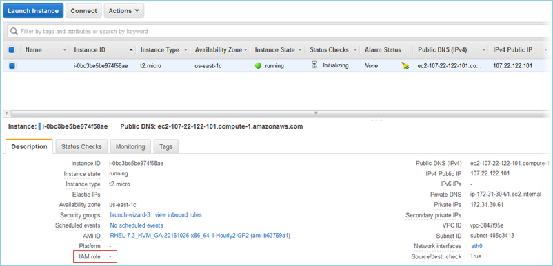

layout: true

<div class="my-footer"><span>https://enpiar.com/talks/user-2021/</span></div>

---
background-image: url(img/zoolander_school2.jpeg)
background-size: cover

---

# What are "big data problems"?

* Bigger than memory (however much memory I have)

* Not local to my machine: cloud storage, NFS, etc.

* May be updated/appended to regularly

* Not data I have exclusive ownership of

### R is not designed to solve these problems

---

# Big data solutions?

--


---

# Or just different problems?




---
class: inverse
background-image: url(img/honey-i-shrunk-the-kids2.jpeg)
background-size: cover

## Arrow can help you find "small" solutions to big data problems

---

# 

* Started 2016, 1.0 release July 2020. Latest version: 4.0

* Shared foundation for data analysis, built on lessons of existing data frame libraries and databases

* Designed to take advantage of modern hardware

* Language-agnostic data format; libraries in 12 languages

🔗 https://arrow.apache.org/

---

# {arrow} R package

```r
install.packages("arrow")
```

https://arrow.apache.org/docs/r/

Also available on `conda`; nightly binary packages also available

---

# Real world applications of {arrow}

* Read and write Parquet files

* Query multi-file partitioned datasets using {dplyr}, without having to pull everything into memory

* Write/repartition datasets for faster querying

* Read and write cloud data storage easily

### Allow working within resource constraints--without requiring bigger machines or Big Data tech stack (and associated complexity)

---

# 1. Use Parquet

Apache Parquet is a binary, columnar data file format

* Supports various compression libraries and encodings: small, efficient files

* Can contain "row groups" as well as column statistics: libraries can use this for even faster filtering/reading

* Widely used in Big Data systems: good for sharing with other teams (which may not use R)

* Benchmarks: https://ursalabs.org/blog/2020-feather-v2/

### {arrow} lets you <u>read_parquet()</u> and <u>write_parquet()</u>

---

# Use case: Parquet in a Shiny app

* Problem: Shiny app on top of CSV data

* CSVs were too large to fit on shinyapps.io

* Also, slow

* Converting data to .parquet and querying with {arrow} / {dplyr} solved both issues

https://github.com/mthomas-ketchbrook/shiny_arrow

---

# 2. Partitioning data

* When files are too big to read into memory, split (partition) into multiple files

* Can encode data in directory paths and use them in filtering: avoid touching some files entirely

* Many (Big) data-generating systems (logs, etc.) will write out data into multiple files like this

### {arrow} can help you <u>open_dataset()</u> to read a (nested) directory of partitioned files <br/> and <u>write_dataset()</u> to create partitioned files

---

# 2. Partitioning data

```r
mtcars %>%
  group_by(cyl) %>%
  write_dataset("motor-trend")

system("tree motor-trend")

# motor-trend/
# ├── cyl=4
# │   └── part-1.parquet
# ├── cyl=6
# │   └── part-0.parquet
# └── cyl=8
#     └── part-2.parquet
```

---

# Use case: fraud detection

Data: 36m rows x 200 columns

First, convert from CSV to Parquet and partition by month:

```r
write_dataset(df, destination_dir, format = "parquet",
  partitioning = "score_mth")
```

Why Parquet?

* Sharing with other teams

* {arrow} lets you treat the directory of files as a single entity

---

# Use case: fraud detection

Next, check data integrity:

```r
ds %>%
  select(starts_with("billing"), starts_with('shipping'), 'score_mth') %>%
  group_by(score_mth) %>%
  collect() %>%
  summarise_all(funs(mean(!is.na(.))))
```

Then, modeling: selecting only columns needed

---

# Use case: research on homelessness

* British Columbia government trying to estimate size of homeless population

* Data stored in thousands of fixed-width files from diverse sources with no consistent API (e.g different time windows)

* Computing infrastructure is memory constrained; fwf files could only be read on the largest machine available

--

* Using {arrow} (on the big machine), write to Parquet files partitioned by year and month

```r
read_very_large_fwf() %>%
  group_by(year, month) %>%
  write_dataset()
```

---

# Use case: research on homelessness

Benefits from using {arrow}:

* A fast queryable process that enables interactive exploratory data analysis. Select subset from dataset with billions of rows, hundreds of columns:

```r
open_dataset(service_data) %>%
  filter(id %in% popn_of_interest) %>%
  filter(year == year_of_interest) %>%
  select(id, service_measure) %>%
  collect()
```

* Ability to thrive under constraints: "We no longer need as much RAM. Arrow is so efficient that we don't have to fight for scarce powerful computers."

* Standardizing the data API without having to put everything in a database

* Future-proof: would be easier to move to a big database in the future because using Parquet files and {dplyr} to query


---

# Use case: monitoring COVID

Shiny app with COVID-19 stats in Chile: https://coronavirus.mat.uc.cl/

Use {arrow} to organize datasets in folders and query with {dplyr} to only read in the necessary subset of data


---

# Use case: monitoring COVID

Mena et al., "Socioeconomic status determines COVID-19 incidence and related mortality in Santiago, Chile", _Science_ 28 May 2021: Vol. 372, Issue 6545

https://science.sciencemag.org/content/372/6545/eabg5298.abstract


---

# 3. Data in the cloud

* Need to read/write data in cloud storage (AWS S3, GCP, etc.)

* {arrow} includes first-class support for working with S3 or S3-like file systems: `read_parquet("s3://bucket/file.parquet")`, `open_dataset("s3://bucket/")`

* Using {dplyr} methods, can select/filter data without having to download everything

* Recent work to improve read speed (esp. from S3 on EC2)

https://arrow.apache.org/docs/r/articles/fs.html

---

# Use case: checking your thermostat

https://www.jaredlander.com/2021/03/analyzing-room-temperature-data/

* Workflow that collects data from thermostats/sensors throughout the house and uploads to cloud storage

* DigitalOcean, with S3-like interface

* {arrow} lets you the cloud storage bucket like a local directory of files and gives methods for browsing it

* Can use {dplyr} on that to read in only a subset of rows/columns: avoids having to download everything from the cloud

---

# Thanks! 👋

* Thanks to all who suggested use cases for the talk, and especially to @big_bad_sam, @jaredlander, @mike_ketchbrook, @pachadotdev,  and @TuckerAlbers

* Arrow contributors: 600+ and growing

### https://arrow.apache.org/

### @enpiar
